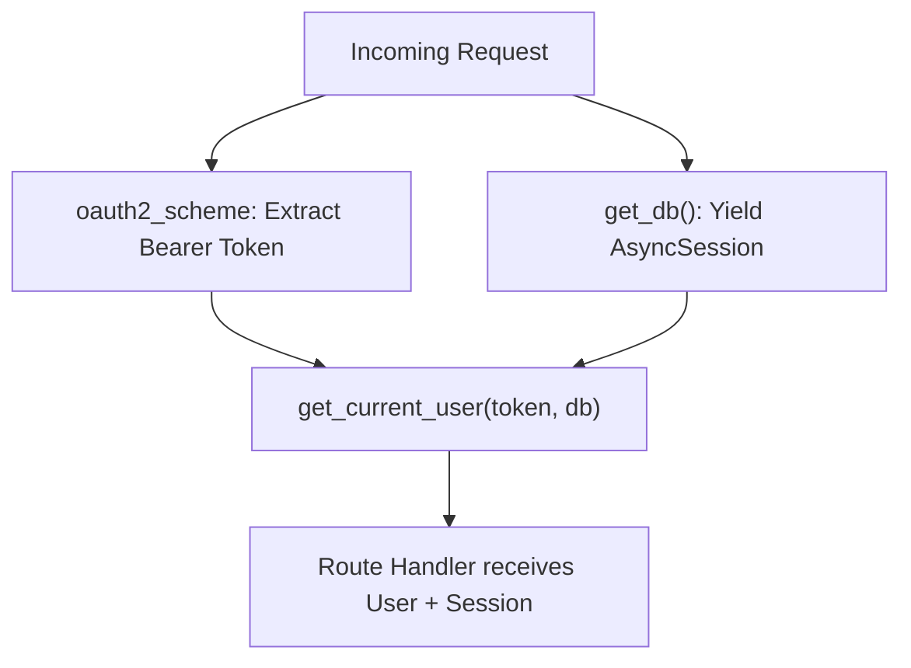
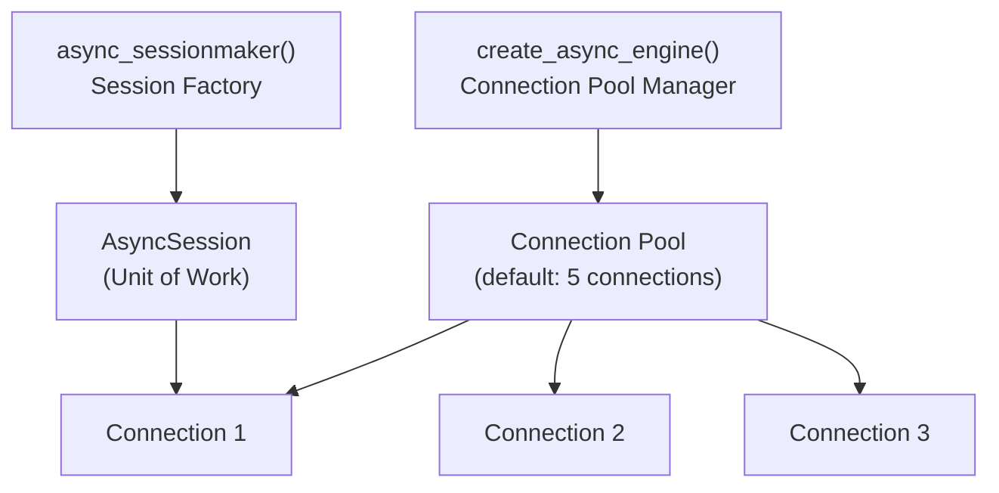
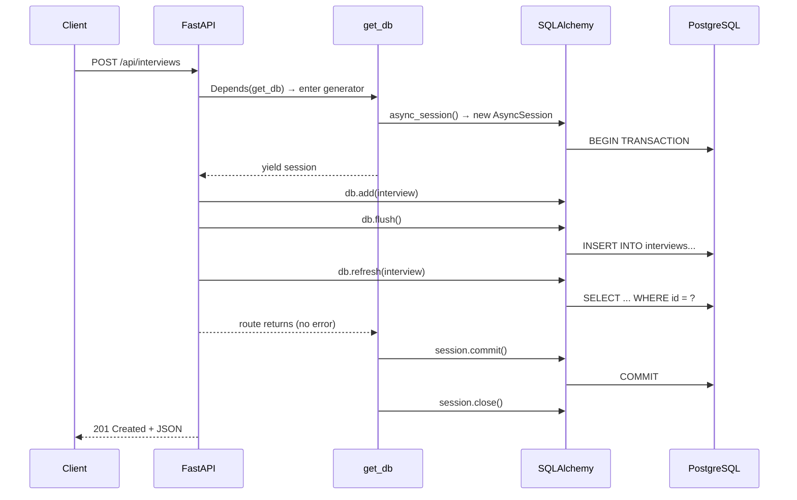
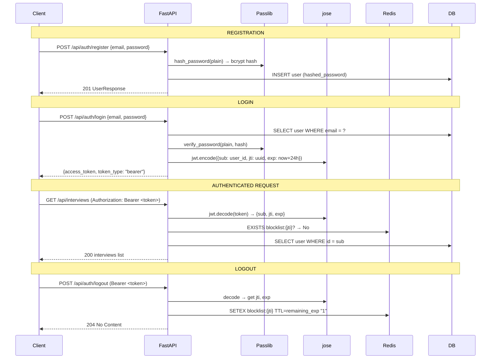

# FastAPI & SQLAlchemy — Interview-Ready Deep Dive (Part 1)

> [!TIP]
> Every code example is grounded in **your AI Interviewer codebase**. File references link directly to your project so you can cross-reference.

---

## Module 1 — FastAPI Fundamentals

### 1.1 What is FastAPI and why did you choose it?

**Q: Why FastAPI over Flask or Django REST Framework?**

| Feature | Flask | Django REST | FastAPI |
|---|---|---|---|
| Async native | ❌ (needs Quart) | ❌ | ✅ built-in |
| Auto OpenAPI docs | ❌ | Partial | ✅ Swagger + ReDoc |
| Type validation | ❌ manual | Serializers | ✅ Pydantic v2 |
| Performance | ~300 rps | ~200 rps | ~3000+ rps (Starlette) |
| Learning curve | Low | High | Low-Medium |

**Your answer:** *"I chose FastAPI because the AI Interviewer needs async I/O for concurrent LLM calls, WebSocket audio streaming, and database queries. FastAPI gives me automatic request validation via Pydantic, auto-generated Swagger docs at `/docs`, and native async/await — all critical for a real-time interview platform."*

---

### 1.2 Application Lifecycle & Startup

**Q: Explain how your FastAPI app boots up. What is the `lifespan` context manager?**

Your app uses the modern `lifespan` pattern (replacing deprecated `on_event`):

```python
# From your main.py
@asynccontextmanager
async def lifespan(app: FastAPI) -> AsyncGenerator[None, None]:
    # STARTUP: runs before first request
    if not settings.is_production:
        await create_tables()          # Dev-only table creation
    await get_redis()                  # Open Redis connection pool
    
    yield  # ← App runs and serves requests here
    
    # SHUTDOWN: runs after last response
    await close_redis()                # Graceful cleanup
```

**Why this matters:**
- Resources (DB connections, Redis pools) are initialized **once**, not per-request
- The `yield` separates startup from shutdown — if startup fails, shutdown never runs
- In production you'd use **Alembic migrations** instead of `create_tables()`

**Follow-up Q: What happens if Redis is down on startup?**
*"In my code, `get_redis()` creates a lazy connection. It doesn't ping Redis immediately. If Redis is unavailable later, every Redis-dependent function has a `try/except` that fails open — meaning auth and caching degrade gracefully but the app doesn't crash."*

---

### 1.3 Dependency Injection — The Heart of FastAPI

**Q: Explain FastAPI's `Depends()` system. How did you use it?**

FastAPI's DI system lets you declare reusable, composable dependencies:



**Three dependency patterns in your codebase:**

**1. Generator dependency (DB session):**
```python
async def get_db() -> AsyncGenerator[AsyncSession, None]:
    async with async_session() as session:
        try:
            yield session        # Injected into route
            await session.commit()
        except Exception:
            await session.rollback()
            raise
```

**2. Chained dependency (Auth → User):**
```python
async def get_current_user(
    token: str = Depends(oauth2_scheme),   # Step 1: extract token
    db: AsyncSession = Depends(get_db),    # Step 2: get DB session
) -> User:
    # Step 3: decode JWT, query DB, return User
```

**3. Role-based dependency (Admin guard):**
```python
async def get_current_admin(
    current_user: User = Depends(get_current_user)  # Chains on top
) -> User:
    if not current_user.is_admin:
        raise HTTPException(403, "Admin privileges required")
    return current_user
```

**Grill Q: Can dependencies be overridden? How does that help testing?**
*"Yes — `app.dependency_overrides[get_db] = _override_get_db`. In my conftest.py, I swap the real Postgres session with an in-memory SQLite session. This means tests run in isolation without touching the real database."*

---

### 1.4 Request Validation with Pydantic v2

**Q: How does Pydantic v2 differ from v1? Show examples from your project.**

Key Pydantic v2 changes you use:

```python
# Your UserRegister schema
class UserRegister(BaseModel):
    email: EmailStr                                    # Built-in email validator
    password: str = Field(..., min_length=8, max_length=128)  # Constraints
    full_name: str | None = Field(None, max_length=255)       # Python 3.10+ union
```

| Feature | Pydantic v1 | Pydantic v2 (yours) |
|---|---|---|
| Config | `class Config: orm_mode = True` | `model_config = {"from_attributes": True}` |
| Union syntax | `Optional[str]` | `str \| None` |
| Performance | Pure Python | Rust core (5-50x faster) |
| Validation | `.dict()` | `.model_dump()` |
| JSON | `.json()` | `.model_dump_json()` |

**Q: What does `from_attributes = True` do?**
*"It tells Pydantic to read data from ORM model attributes (like `user.email`) instead of requiring a dictionary. This is critical because FastAPI's `response_model` needs to serialize SQLAlchemy model instances directly into JSON responses."*

**Q: How does FastAPI use Pydantic for response serialization?**
```python
@router.post("/register", response_model=UserResponse, status_code=201)
async def register(data: UserRegister, db=Depends(get_db)) -> User:
    # Returns an ORM User object, but FastAPI auto-serializes it
    # through UserResponse (which has from_attributes=True)
    return user
```

---

### 1.5 Router Organization & API Design

**Q: How did you structure your API? What's the rationale?**

```
/api/auth/          → Authentication (register, login, logout, me)
/api/interviews/    → Full interview CRUD lifecycle  
/api/media/         → TTS, STT, WebSocket streaming
/api/admin/         → Platform metrics, user management (role-guarded)
```

Each router is a separate file with its own prefix and tags:
```python
router = APIRouter(prefix="/api/interviews", tags=["interviews"])
app.include_router(interviews_router)  # Mounted in main.py
```

**Q: Why prefix-based routing over path-based?**
*"Prefix-based lets me version APIs easily (`/api/v2/interviews/`), keeps routers self-contained, and auto-groups them in Swagger docs by tag."*

---

### 1.6 Error Handling Patterns

**Q: How do you handle errors consistently across your API?**

```python
# Pattern 1: HTTPException for client errors
if not interview:
    raise HTTPException(status_code=404, detail="Interview not found")

# Pattern 2: Ownership verification (authorization)
if interview.user_id != user_id:
    raise HTTPException(status_code=403, detail="Not authorised")

# Pattern 3: Graceful degradation for non-critical services
try:
    r = await get_redis()
    cached = await r.get(cache_key)
except Exception:
    r = None  # Redis down? Continue without cache

# Pattern 4: Fallback for AI pipeline failures
except Exception as exc:
    evaluation = {"score": 5.0, "feedback": "Answer recorded."}
```

**Q: How would you add a global exception handler?**
```python
@app.exception_handler(Exception)
async def global_handler(request: Request, exc: Exception):
    logger.error(f"Unhandled: {exc}", exc_info=True)
    return JSONResponse(status_code=500, content={"detail": "Internal error"})
```

---

### 1.7 CORS & Security Middleware

**Q: Your CORS config allows `*` origins. Is that safe for production?**

```python
# Your current config (fine for dev, dangerous for prod)
app.add_middleware(CORSMiddleware, allow_origins=["*"])

# Production fix:
app.add_middleware(
    CORSMiddleware,
    allow_origins=["https://yourdomain.com", "https://app.yourdomain.com"],
    allow_credentials=True,
    allow_methods=["GET", "POST", "PUT", "DELETE"],
    allow_headers=["Authorization", "Content-Type"],
)
```

*"In development I use `*` for convenience, but in production on EKS I'd restrict origins to the frontend's domain, limit methods, and ensure `allow_credentials` only works with explicit origins."*

---

## Module 2 — SQLAlchemy Async ORM Deep Dive

### 2.1 Engine & Session Architecture

**Q: Explain the difference between Engine, Session, and Connection in SQLAlchemy.**



**Your code:**
```python
engine = create_async_engine(
    settings.database_url,
    echo=settings.debug,         # SQL logging in dev
    connect_args=connect_args,   # SQLite: check_same_thread=False
)

async_session = async_sessionmaker(
    engine,
    class_=AsyncSession,
    expire_on_commit=False,  # Objects remain usable after commit
)
```

**Q: Why `expire_on_commit=False`?**
*"By default, SQLAlchemy expires all attributes after commit, meaning any subsequent attribute access triggers a lazy load (which fails in async). Setting this to False means I can safely return the ORM object from my route handler after commit without triggering implicit I/O."*

---

### 2.2 Declarative Models (Mapped Columns)

**Q: Explain the modern `Mapped[]` + `mapped_column()` syntax vs the old `Column()` style.**

```python
# OLD style (SQLAlchemy 1.x)
class User(Base):
    id = Column(String(36), primary_key=True)
    email = Column(String(255), unique=True)

# YOUR style (SQLAlchemy 2.0 — type-safe)
class User(Base):
    id: Mapped[str] = mapped_column(String(36), primary_key=True, 
                                     default=lambda: str(uuid.uuid4()))
    email: Mapped[str] = mapped_column(String(255), unique=True, 
                                        nullable=False, index=True)
    is_active: Mapped[bool] = mapped_column(Boolean, default=True)
```

**Advantages of 2.0 style:**
- Full type-checker support (mypy/pyright see `Mapped[str]`)
- `nullable` inferred from type (`str | None` = nullable, `str` = NOT NULL)
- IDE autocomplete on model attributes

---

### 2.3 Relationships & Lazy Loading in Async

**Q: How do relationships work in async SQLAlchemy? What are the gotchas?**

```python
# User → Interviews (One-to-Many)
class User(Base):
    interviews: Mapped[list[Interview]] = relationship(
        "Interview", back_populates="user", cascade="all, delete-orphan"
    )

# Interview → Result (One-to-One)
class Interview(Base):
    result: Mapped[Result | None] = relationship(
        "Result", back_populates="interview",
        uselist=False,                    # One-to-one, not one-to-many
        cascade="all, delete-orphan",
    )
```

**The critical async gotcha:**
```python
# ❌ BROKEN in async — triggers implicit lazy load
user = await db.get(User, user_id)
print(user.interviews)  # raises MissingGreenlet error!

# ✅ FIX 1: Eager load with selectinload
from sqlalchemy.orm import selectinload
result = await db.execute(
    select(User).options(selectinload(User.interviews)).where(User.id == id)
)

# ✅ FIX 2: Use a separate query (your approach)
interviews = await db.execute(
    select(Interview).where(Interview.user_id == user.id)
)
```

**Q: Explain `cascade="all, delete-orphan"`. What SQL does it generate?**
*"When I delete a User, SQLAlchemy automatically deletes all their Interviews (cascade delete). `delete-orphan` means if I remove an Interview from `user.interviews` list without explicitly deleting it, SQLAlchemy deletes the orphaned row. This maps to `ON DELETE CASCADE` at the DB level."*

---

### 2.4 Querying Patterns (Select, Filter, Aggregate)

**Q: Show me the different query patterns you used.**

```python
# 1. Simple lookup
result = await db.execute(select(User).where(User.email == data.email))
user = result.scalar_one_or_none()  # Returns User or None

# 2. Pagination with count
count_result = await db.execute(
    select(func.count()).select_from(Interview)
    .where(Interview.user_id == current_user.id)
)
total = count_result.scalar() or 0

query = (
    select(Interview)
    .where(Interview.user_id == current_user.id)
    .order_by(Interview.created_at.desc())
    .offset(skip).limit(limit)
)
interviews = (await db.execute(query)).scalars().all()

# 3. Aggregation
avg_score = await db.execute(select(func.avg(Result.overall_score)))

# 4. First-user check (for auto-admin)
user_count = (await db.execute(
    select(func.count()).select_from(User)
)).scalar() or 0
is_first_user = (user_count == 0)
```

**Q: `.scalar_one_or_none()` vs `.scalars().all()` vs `.scalar()` — when to use which?**

| Method | Returns | Use case |
|---|---|---|
| `.scalar_one_or_none()` | Single object or `None` | Lookup by unique key |
| `.scalar_one()` | Single object (raises if 0 or 2+) | When exactly 1 row expected |
| `.scalars().all()` | `list[Model]` | Multi-row queries |
| `.scalar()` | Single value (first col, first row) | `COUNT()`, `AVG()`, `MAX()` |

---

### 2.5 Session Lifecycle & Transaction Management

**Q: Walk me through the request lifecycle of a database transaction.**



**Q: What's the difference between `flush()` and `commit()`?**
- **`flush()`**: Sends pending SQL to the DB but **within the current transaction**. The data is visible to subsequent queries in the same session but NOT to other connections.
- **`commit()`**: Finalizes the transaction. Makes changes permanent and visible to all.

*"In my code, I `flush()` after adding objects so `db.refresh()` can read back server-generated defaults (like the UUID). The actual `commit()` happens in the `get_db()` generator's cleanup — so if any later code raises an exception, the entire transaction rolls back."*

---

### 2.6 Migrations with Alembic

**Q: You use `create_tables()` in dev. How would you handle schema changes in production?**

```bash
# Initialize Alembic
alembic init alembic

# Generate migration from model changes
alembic revision --autogenerate -m "add_cheating_flags_column"

# Apply migrations
alembic upgrade head

# Rollback
alembic downgrade -1
```

**Generated migration example:**
```python
def upgrade():
    op.add_column('results', sa.Column('cheating_flags', sa.Text(), nullable=True))

def downgrade():
    op.drop_column('results', 'cheating_flags')
```

*"In production, I'd never use `create_tables()`. Alembic tracks schema versions in a table called `alembic_version`, ensuring migrations are idempotent and reversible. In my CI/CD pipeline, `alembic upgrade head` runs before the new container starts serving traffic."*

---

## Module 3 — Authentication & Security

### 3.1 JWT Flow End-to-End

**Q: Walk through your complete authentication flow.**



### 3.2 Token Revocation via Redis Blocklist

**Q: JWTs are stateless. How did you implement logout?**

*"JWTs can't be invalidated server-side by default. I solved this with a Redis blocklist. Each token has a unique `jti` (JWT ID). On logout, I store `blocklist:{jti}` in Redis with a TTL equal to the token's remaining lifetime. On every authenticated request, `get_current_user` checks Redis before hitting the DB."*

```python
# Revocation (logout)
await r.setex(f"blocklist:{jti}", ttl, "1")

# Verification (every request)
if await r.exists(f"blocklist:{jti}"):
    raise HTTPException(401, "Token has been revoked")
```

**Q: What if Redis goes down?**
*"I use a fail-open strategy — the except block catches Redis errors and falls through to normal DB auth. The user stays logged in but logout tokens aren't checked. This is a conscious trade-off: availability over strict security, which I'd flag in a security review."*

### 3.3 Rate Limiting

**Q: How did you implement rate limiting?**

```python
async def check_rate_limit(request, action, limit=10, window=60):
    key = f"rate_limit:{action}:{client_ip}"
    attempts = await r.incr(key)       # Atomic increment
    if attempts == 1:
        await r.expire(key, window)    # Set TTL on first hit
    if attempts > limit:
        raise HTTPException(429, "Too many requests")
```

*"This is a sliding window counter using Redis INCR. The first request creates the key and sets a 60-second TTL. Subsequent requests increment it. After 10 attempts within the window, we return 429. The key auto-expires, resetting the counter."*

**Q: What's wrong with this sliding window approach?**
*"It's actually a fixed window — if someone sends 9 requests at second 59 and 9 more at second 61, they've made 18 requests in 2 seconds but never hit the limit. A true sliding window would use Redis sorted sets with timestamps. For login rate limiting, though, fixed window is acceptable."*

---

## Module 4 — Caching with Redis

### 4.1 Cache-Aside Pattern

**Q: Explain your caching strategy for interview data.**

```python
# READ: Check cache first
cache_key = f"interview:{interview_id}"
cached = await r.get(cache_key)
if cached:
    data = json.loads(cached)
    if data.get("user_id") != current_user.id:
        raise HTTPException(403)  # Auth check even on cached data!
    return data

# MISS: Query DB, then populate cache
interview = await _get_user_interview(interview_id, user_id, db)
schema = InterviewResponse.model_validate(interview)
await r.setex(cache_key, 3600, schema.model_dump_json())  # 1hr TTL

# WRITE: Invalidate on mutation
async def _invalidate_interview_cache(interview_id):
    await r.delete(f"interview:{interview_id}")
```

**Q: What cache invalidation strategy do you use?**
*"Write-through invalidation — every mutation endpoint (upload-resume, submit-answer, complete) calls `_invalidate_interview_cache()`. I also set a 1-hour TTL as a safety net for stale data. For admin metrics, I cache for only 60 seconds since aggregate stats change frequently."*

---

## Module 5 — WebSockets & Real-time Communication

**Q: How does your WebSocket media stream work?**

```python
@router.websocket("/stream")
async def websocket_media_stream(websocket: WebSocket):
    await websocket.accept()
    try:
        while True:
            data = await websocket.receive_bytes()     # Raw audio chunks
            transcript = await SpeechService.speech_to_text(data)
            await websocket.send_json({
                "type": "transcript", "text": transcript
            })
    except WebSocketDisconnect:
        logger.info("Client disconnected")
```

**Q: How would you add JWT auth to WebSockets?**
*"WebSockets don't support Authorization headers after the handshake. I'd pass the token as a query parameter during the initial connection: `ws://host/stream?token=xxx`. In the handler, before `accept()`, I'd decode and validate the token manually."*

```python
@router.websocket("/stream")
async def ws(websocket: WebSocket):
    token = websocket.query_params.get("token")
    if not token:
        await websocket.close(code=4001)
        return
    try:
        user = await validate_token(token)
    except:
        await websocket.close(code=4003)
        return
    await websocket.accept()
```

---

*Continued in Part 2: Advanced Backend Topics, System Design, and General Full-Stack Questions →*
