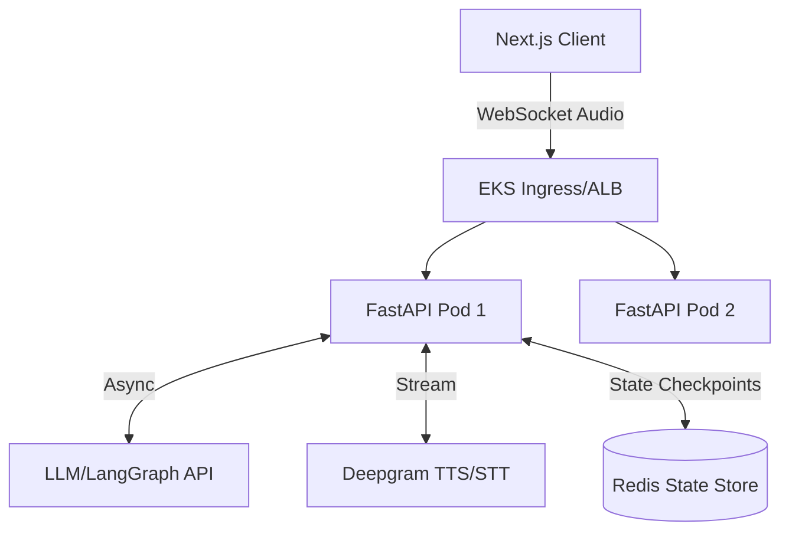
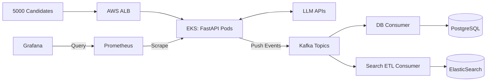

# LG Soft India - Research Engineer Interview Prep Guide

Welcome to your technical interview preparation. As a Research Engineer interviewer at LG Soft India, I have mapped our Job Description specifically to your **AI Technical Interview Agent** and your experience at Tata Technologies. We are going exactly into the deep end!

Our JD focuses heavily on **Scalable Backends (FastAPI), Databases (PostgreSQL/MongoDB/Time-series), AI/ML Pipelines (Agentic RAG, LangChain), and Performance Optimization**. Below are simulated interview questions, expected in-depth answers, and diagrams where necessary.

---

## 1. System Architecture & Scalability (FastAPI & Real-time)

**Q1: In your AI Interviewer project, you used FastAPI for real-time voice interactions with Deepgram TTS/STT. Since Python's GIL can block concurrent operations, how did you ensure that long-running LLM generation and Audio processing didn't block your main event loop, ensuring sub-second latency?**

**Aman's Expected Answer:**
*"In FastAPI, concurrency is handled via the Asyncio event loop. Since network bounds (like hitting OpenAI or Deepgram APIs) can block, I ensured all my HTTP and Websocket calls were native `async` (using `httpx` or async SDKs). For any CPU-bound tasks (like parsing the PDF resume or heavily manipulating the generated audio chunks), I offloaded the work to a background thread pool using `asyncio.to_thread` or FastAPI's `BackgroundTasks`.*

*Specifically for sub-second latency in voice interaction, we used **WebSockets**. Instead of waiting for the entire LLM response to complete, I streamed the text output from the LangGraph agent directly into the Deepgram TTS socket. This pipelined the architecture—as the LLM generates tokens, Deepgram synthesizes audio in parallel, and the frontend consumes the audio chunks instantly."*

**Follow-up (Grill): How would you horizontally scale these Websocket connections across your Kubernetes EKS cluster?**
*Answer:* "WebSockets are stateful. To scale them across EKS pods, I would use a sticky session ingress controller (like NGINX or ALB). Furthermore, because agents might need shared context if a pod dies, I would externalize the conversation state management (LangGraph state) to Redis."



---

## 2. Agentic RAG & AI/ML Frameworks

**Q2: The JD requires experience with Agentic RAG pipelines and LangChain. I see you orchestrated 4 specialized nodes using LangGraph. Explain how state management works between these nodes. What happens if the `JD_Agent` hallucinates and asks an irrelevant question?**

**Expected Answer:**
*"In LangGraph, state is passed between nodes via a shared `TypedDict` or Pydantic model (e.g., `InterviewState`). Each node (Resume, JD, Scoring, Question) receives the state, mutates it, and returns the update.*
*To prevent hallucinations:*
1. **RAG Context Guardrails**: The Prompt Template for the `Question_Agent` strictly enforces that questions must purely map the intersections of the Resume RAG chunks and JD RAG chunks.
2. **Evaluation Node**: I would add (or have) a validation edge/node. If the generated question's cosine similarity against the JD context falls below a certain threshold, a conditional edge routes the flow back to the `Question_Agent` with an error prompt to regenerate.

**Q3: How did you implement indexing for the RAG pipeline? If a user uploads a 10-page dense software engineering resume, what chunking strategy ensures critical skills aren't lost?**

**Expected Answer:**
*"Standard fixed-size chunking risks splitting context (e.g., splitting a project description in half). I would use **Semantic Chunking** or **Recursive Character Text Splitting** with significant overlap. Furthermore, I would extract 'Metadata' (like entities: "Python", "React", "AWS") during the chunking phase and add it to the Vector Store. When querying, I'd apply a Multi-Query or Self-Query retriever that uses the metadata to pre-filter chunks before performing similarity search."*

---

## 3. Databases, SQL Optimization & Time-Series Data

**Q4: Our JD heavily tests database skills (PostgreSQL, CTEs, Time-series). Let's say we have millions of rows of interview session analytics in your async SQLAlchemy PostgreSQL DB. Write or explain a query using a Common Table Expression (CTE) to find the top 3 weaknesses (skill gaps) of candidates who scored below 50% in the last 30 days.**

**Expected Answer:**
*"A CTE (using `WITH` clause) makes complex aggregations readable. I would structure it like this:"*
```sql
WITH FailedInterviews AS (
    SELECT session_id, candidate_id 
    FROM interview_sessions 
    WHERE overall_score < 50 
      AND created_at >= NOW() - INTERVAL '30 days'
),
SkillGaps AS (
    SELECT gap_name, COUNT(*) as frequency
    FROM session_skill_gaps ssg
    JOIN FailedInterviews fi ON ssg.session_id = fi.session_id
    GROUP BY gap_name
)
SELECT gap_name, frequency 
FROM SkillGaps 
ORDER BY frequency DESC 
LIMIT 3;
```
*"In SQLAlchemy, this is achievable using `select().cte('FailedInterviews')` and then querying against it. To optimize this, I would ensure there is a composite B-Tree index on `(created_at, overall_score)` on the `interview_sessions` table."*

**Q5: If we want to capture real-time metrics during the interview (e.g., candidate pause duration, STT latency, heart rate if we had camera analytics), would you put this in PostgreSQL? How would MongoDB or a Time-series DB be better suited?**

**Expected Answer:**
*"PostgreSQL is great for relational consistency, but high-frequency time-stamped data would bloat the tables and degrade insert performance. For time-series metrics, a specialized DB like InfluxDB, Prometheus, or MongoDB (using Time Series collections) is better. MongoDB Time Series collections are highly optimized for ordered metrics, compressing the data automatically and allowing very fast windowed aggregations via the Aggregation Pipeline which perfectly matches our need to monitor latency and load."*

---

## 4. Software Engineering & CI/CD Pipelines

**Q6: You mentioned writing 90+ test cases using PyTest, achieving 85%+ coverage. How do you test a LangGraph multi-agent system reliably in your CI/CD pipeline without making actual API calls to OpenAI which costs money and introduces flakiness?**

**Expected Answer:**
*"In PyTest, I heavily utilized the `unittest.mock` library, specifically `patch`. For unit testing agents, I mocked the `ChatOpenAI.invoke` or `astream` methods to return generic predefined `AIMessage` objects. 
To test the entire LangGraph orchestration (Integration Test), I used libraries like `responses` or `VCR.py` to record HTTP interactions once and replay them in subsequent CI runs. This ensures the CI/CD pipeline (GitHub Actions) runs in seconds deterministically."*

**Q7: At Tata Technologies, you built a regression validation framework using Pandas and NumPy, which is also on our Good-to-Have list. Can you explain a scenario where native Python loops were too slow, and how vectorization with Pandas/NumPy solved it?**

**Expected Answer:**
*"When validating 10K+ numerical parameters per run (simulating flight physics), doing standard Python `for` loops across rows takes significant time due to Python's dynamic typing overhead. Instead of iterating, I converted the simulation outputs into NumPy arrays or Pandas DataFrames and applied **Vectorized Operations**. For example, calculating deviations `(actual - expected) / expected` was done across the entire dataset in a single C-optimized NumPy operation. This, combined with parallel execution using multiprocessing, reduced computation time by nearly 40%."*

---

## 5. System Design (Interview Grind Question)

**Q8: LG Soft India wants to adapt your AI Interviewer to conduct simultaneous interviews for 5,000 campus hires in one day. The system must index all responses, make them searchable internally via ElasticSearch, and visualize metrics on Grafana. Draw out the architecture.**

**Expected Answer (Walkthrough):**
1. **Load Balancing**: Next.js UI connects via AWS Route53/ALB to an EKS cluster. The EKS auto-scales FastAPI WebSocket pods based on CPU/Memory metrics metrics scraped by **Prometheus**.
2. **Asynchronous Processing**: Instead of synchronous DB writes during the interview, conversation transcripts and scores are published to an event broker like **Apache Kafka** or Redis Streams. 
3. **Consumers & Storage**:
    - A consumer service writes relational data (scores, user profiles) to **PostgreSQL**.
    - Another consumer runs an ETL pipeline to pipe the raw transcripts to **ElasticSearch**, enabling the HR team to specifically search for keywords like *"Candidate mentioned microservices in response to question 3"*.
4. **Monitoring (Observability)**: FastAPI exposes a `/metrics` route using `prometheus-client`. Prometheus scrapes these metrics (latency, token usage counts, error rates). **Grafana** visualizes these metrics on dashboards for the engineering team.



---

### Tips for Delivery:
* **"I don't know" is okay**: If an interviewer asks a highly specific Kubernetes or ElasticSearch question you don't know, pivot by saying, "I haven't deployed ElasticSearch from scratch entirely, but I have experience optimizing unstructured data, and given my ability to rapidly learn in my past roles, I am confident I could implement it."
* **Relate to your impact**: Highlight your metrics. Say "Just like I reduced manual verification effort by 80% at Tata Technologies, I utilized caching in my AI interviewer to reduce API costs and latency."
* **Know your Resume**: They will absolutely ask about your ApexCharts integration and the regression validation frameworks you built. Have STAR (Situation, Task, Action, Result) format stories ready for them!
