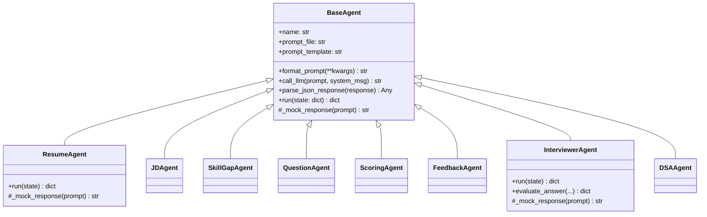
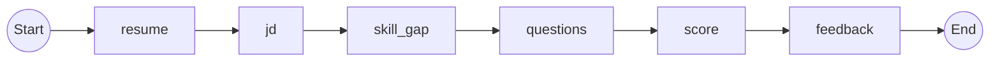

# LangGraph, LangChain & AI Agents — Course + Interview Guide (Part 1)

> [!TIP]
> This guide teaches you the concepts from first principles and ties every concept back to **your AI Interviewer codebase**. Read this and you'll understand what you built *and* why.

---

## Module 1 — Foundations: LLMs, APIs & Prompt Engineering

### 1.1 What is an LLM and how does the OpenAI API work?

**Q: Explain what happens when you call `client.chat.completions.create()` in your BaseAgent.**

An LLM (Large Language Model) is a neural network trained on text that predicts the next token. When you call the API:

1. Your **prompt** (system message + user message) is **tokenized** — split into sub-word units
2. The model generates tokens one at a time, each conditioned on all previous tokens
3. **Temperature** controls randomness: 0 = deterministic, 1 = creative, your code uses **0.7** (balanced)
4. The response is streamed back (or returned as a whole) as a `ChatCompletion` object

```python
# From your base_agent.py
client = AsyncOpenAI(api_key=settings.openai_api_key)

messages = [
    {"role": "system", "content": "You are an expert resume analyzer."},
    {"role": "user", "content": prompt}
]

response = await client.chat.completions.create(
    model=settings.openai_model,          # "gpt-4o-mini" or Groq model
    messages=messages,
    temperature=0.7,
    response_format={"type": "json_object"},  # Force JSON output
)

text = response.choices[0].message.content
```

**Q: What does `response_format={"type": "json_object"}` do?**
*"It constrains the LLM to only generate valid JSON. Without it, the model might wrap JSON in markdown code blocks or add conversational text around it. This is critical because my `parse_json_response()` relies on getting clean JSON back. Note: this only works when the system/user message explicitly mentions JSON."*

**Q: Why `AsyncOpenAI` instead of `OpenAI`?**
*"My FastAPI app is fully async. Using the sync `OpenAI` client inside an `async def` handler would block the entire event loop during the API call (often 2-10 seconds). `AsyncOpenAI` uses `httpx` under the hood with native `await`, so other requests can be served while waiting for the LLM response."*

---

### 1.2 Tokens, Context Windows & Cost

**Q: What are tokens? How do they affect your system?**

| Concept | Explanation |
|---|---|
| **Token** | Sub-word unit (~4 chars in English). "interviewer" ≈ 3 tokens |
| **Context window** | Max tokens the model can see (input + output). GPT-4o = 128K |
| **Input tokens** | Your prompt (resume text, JD, system message) |
| **Output tokens** | The model's response (generated JSON) |
| **Cost** | Billed per 1K tokens. Input is cheaper than output |

**Why this matters for your project:**
- A resume might be 500-1000 tokens. A JD might be 500-800 tokens.
- Your `ScoringAgent` prompt includes the ENTIRE transcript + questions + JD + resume analysis — that could be 5,000-10,000 tokens.
- If you hit the context window limit, the model silently truncates old content.

**Q: How would you reduce token usage?**
*"Three strategies: (1) Summarize the resume/JD before passing to later agents instead of passing raw text. (2) Only pass relevant transcript entries to the scoring agent, not all of them. (3) Use a cheaper/smaller model for simpler tasks like skill gap analysis, and reserve GPT-4o for complex scoring."*

---

### 1.3 Prompt Engineering Patterns

**Q: What prompt engineering techniques are visible in your codebase?**

**1. Role assignment (System Message):**
```
"You are an expert resume analyzer. Always respond with valid JSON."
```
Each agent has a specific persona — resume analyzer, career advisor, technical interviewer.

**2. Structured output template (User Message):**
```
Output a JSON object with the following structure:
{{
    "skills": ["list of technical and soft skills"],
    "experience_years": <number>,
    ...
}}
```
You give the model a **schema to fill in** — this dramatically improves output consistency.

**3. Calibration instructions:**
```
Scoring Guidelines:
- 0-2: Completely wrong or no answer
- 3-4: Shows some understanding but major gaps
- 7-8: Good answer covering most key points
```
This is a **rubric** — it anchors the model's scoring to specific criteria.

**4. Behavioral guardrails:**
```
CRITICAL INSTRUCTION: You MUST explicitly reference the candidate's past
projects, companies, or tools mentioned in their resume_analysis
```
This prevents generic output and forces the model to be specific.

**5. Double-brace escaping `{{` `}}`:**
Your prompt files use `{resume_text}` for Python `str.format()` variables, but `{{` for literal JSON braces. This is how you combine Python string formatting with JSON output schemas.

---

## Module 2 — Your BaseAgent Architecture

### 2.1 The Inheritance Pattern

**Q: Explain the design pattern behind your agent system.**



*"This is the **Template Method pattern**. BaseAgent defines the skeleton: load a prompt file → format it → call the LLM → parse JSON. Each subclass only overrides `run()` (what to do with the state) and `_mock_response()` (test data). The shared behavior — API calls, JSON parsing, error handling — lives in one place."*

**Q: What's the advantage of this pattern over having each agent as a standalone function?**
- **DRY**: LLM client setup, JSON parsing, mock mode — all in one place
- **Testability**: Override `_mock_response()` for deterministic tests
- **Swappability**: Change the LLM provider in BaseAgent, all agents update
- **Consistency**: Every agent handles errors the same way

### 2.2 Lazy Prompt Loading

**Q: How do your prompt templates work?**

```python
# BaseAgent loads prompts lazily from the prompts/ directory
PROMPTS_DIR = Path(__file__).parent.parent / "prompts"

@property
def prompt_template(self) -> str:
    if self._prompt_template is None and self.prompt_file:
        prompt_path = PROMPTS_DIR / self.prompt_file
        self._prompt_template = prompt_path.read_text(encoding="utf-8")
    return self._prompt_template or ""
```

*"Prompts are stored as `.txt` files on disk, not hardcoded in Python. This means: (1) Non-engineers can edit prompts without touching code. (2) We could version prompts independently or A/B test them. (3) The `@property` with `_prompt_template` cache means the file is read only once per agent instance."*

### 2.3 Robust JSON Parsing

**Q: Why do you need `parse_json_response()`? Doesn't `response_format=json_object` guarantee JSON?**

*"Not always. If the API call falls back to a model that doesn't support `response_format`, or if the provider (Groq) wraps the JSON differently, we need fallback parsing. My parser tries three strategies:"*

```python
def parse_json_response(self, response: str) -> Any:
    # 1. Direct parse — works 90% of the time
    try: return json.loads(response)
    except: pass

    # 2. Extract from markdown ```json ... ``` blocks
    json_match = re.search(r"```(?:json)?\s*\n(.*?)\n\s*```", response, re.DOTALL)
    if json_match:
        try: return json.loads(json_match.group(1))
        except: pass

    # 3. Find any bare {…} or [...] in the response
    for pattern in [r"\{.*?\}", r"\[.*?\]"]:
        matches = re.findall(pattern, response, re.DOTALL)
        for match in matches:
            try: return json.loads(match)
            except: continue

    # 4. Last resort: wrap raw text in a dict
    return {"raw_response": response}
```

### 2.4 Mock Mode for Development

**Q: How does your system work without an API key?**

```python
async def call_llm(self, prompt, system_message=""):
    if not settings.has_openai_key:
        return await self._mock_response(prompt)  # Each agent returns realistic fake data
    try:
        # Real API call...
    except Exception:
        return await self._mock_response(prompt)   # Fallback on failure too
```

*"Each agent overrides `_mock_response()` with realistic sample data. The ResumeAgent returns a mock profile with skills and projects. The ScoringAgent returns a mock B+ grade. This means developers can run the full interview flow, frontend included, without spending a single API credit. In CI/CD, I force mock mode by setting `openai_api_key = ''` in conftest.py."*

---

## Module 3 — The Multi-Agent Pipeline

### 3.1 Your 8 Agents and Their Roles

| Agent | Input | Output | Purpose |
|---|---|---|---|
| **ResumeAgent** | `resume_text` | `resume_analysis` | Extract skills, projects, experience |
| **JDAgent** | `jd_text` | `jd_analysis` | Extract required/preferred skills, role info |
| **SkillGapAgent** | `resume_analysis` + `jd_analysis` | `skill_gap_report` | Find matching/missing/additional skills |
| **QuestionAgent** | All above + settings | `questions[]` | Generate personalized interview questions |
| **InterviewerAgent** | Single Q + A | `evaluation` | Real-time per-answer scoring |
| **DSAAgent** | `jd_analysis` + difficulty | `dsa_problems[]` | Generate coding challenges |
| **ScoringAgent** | `transcript` + `questions` | `scoring_result` | Overall multi-dimensional scoring |
| **FeedbackAgent** | `scoring_result` + all analyses | `feedback_result` | 30-day improvement plan |

### 3.2 The Two Pipelines

**Q: Walk through your complete pipeline architecture.**

```mermaid
graph TD
    subgraph "Pipeline 1: Preparation (before interview)"
        R[ResumeAgent] -->|resume_analysis| J[JDAgent]
        J -->|jd_analysis| S[SkillGapAgent]
        S -->|skill_gap_report| Q[QuestionAgent]
        Q -->|questions list| Ready[Status: QUESTIONS_READY]
    end
    
    subgraph "Pipeline 2: Live Interview (per answer)"
        Answer[Candidate Answer] --> I[InterviewerAgent]
        I -->|score + feedback + follow_up| Adaptive{Score < 8?}
        Adaptive -->|Yes| Inject[Inject follow-up question]
        Adaptive -->|No| Next[Move to next question]
    end
    
    subgraph "Pipeline 3: Scoring (after interview)"
        Complete[Interview Complete] --> SC[ScoringAgent]
        SC -->|scoring_result| F[FeedbackAgent]
        F -->|feedback_result + 30-day plan| Results[Final Results]
    end
```



**Q: Why are the agents sequential and not parallel?**
*"The agents have data dependencies. The SkillGapAgent NEEDS both resume_analysis AND jd_analysis to work. The QuestionAgent needs all three outputs. This creates a DAG (Directed Acyclic Graph) where each node depends on its predecessors. However, ResumeAgent and JDAgent are independent of each other — I could parallelize them with `asyncio.gather()` and shave ~3 seconds off the preparation pipeline."*

### 3.3 Shared State — The Pipeline Dict

**Q: How do agents communicate? What is the `state` dict?**

```python
# From orchestrator.py — the state flows through every agent
state = {
    # Inputs (set at start)
    "resume_text": resume_text,
    "jd_text": jd_text,
    "interview_type": "full",
    "difficulty_level": "medium",
    
    # Outputs (populated by agents)
    "resume_analysis": {},    # Set by ResumeAgent
    "jd_analysis": {},        # Set by JDAgent
    "skill_gap_report": {},   # Set by SkillGapAgent
    "questions": [],          # Set by QuestionAgent
    "scoring_result": {},     # Set by ScoringAgent
    "feedback_result": {},    # Set by FeedbackAgent
}
```

*"This is the **Blackboard pattern** — a shared memory space that agents read from and write to. Each agent reads its inputs from the state, processes them, and writes its outputs back. The orchestrator just calls agents in order. This makes adding a new agent trivial — you just write a new class and add one line in the pipeline."*

---

## Module 4 — LangGraph Deep Dive

### 4.1 What is LangGraph? How is it different from LangChain?

| Aspect | LangChain | LangGraph |
|---|---|---|
| **Core concept** | Chains (sequential LLM calls) | Graphs (nodes + edges) |
| **State** | Passed via chain input/output | Shared `TypedDict` state |
| **Control flow** | Linear or simple branching | Conditional edges, cycles, loops |
| **Best for** | Simple prompt → response | Multi-agent, multi-step workflows |
| **Persistence** | External (you manage) | Built-in checkpointing |
| **Relationship** | Foundation library | Built ON TOP of LangChain |

*"LangChain gives you tools to call LLMs, load documents, and chain operations. LangGraph extends this by letting you build stateful, cyclical workflows as graphs — where agents can loop, branch, and retry based on conditions. Think of LangChain as the engine and LangGraph as the transmission."*

### 4.2 StateGraph — Your Graph Definition

**Q: Explain how your `build_langgraph_workflow()` works, line by line.**

```python
from langgraph.graph import StateGraph

# Step 1: Define shared state schema
class InterviewState(TypedDict, total=False):
    resume_text: str
    jd_text: str
    resume_analysis: dict
    jd_analysis: dict
    skill_gap_report: dict
    questions: list
    scoring_result: dict
    feedback_result: dict
    error: str | None

# Step 2: Create the graph with this state type
graph = StateGraph(InterviewState)

# Step 3: Add nodes (each is an async function that takes state, returns state)
graph.add_node("resume", analyze_resume)
graph.add_node("jd", analyze_jd)
graph.add_node("skill_gap", analyze_skill_gap)
graph.add_node("questions", generate_questions)
graph.add_node("score", evaluate_answers)
graph.add_node("feedback", generate_feedback)

# Step 4: Define edges (execution order)
graph.set_entry_point("resume")
graph.add_edge("resume", "jd")
graph.add_edge("jd", "skill_gap")
graph.add_edge("skill_gap", "questions")
graph.add_edge("questions", "score")
graph.add_edge("score", "feedback")
graph.set_finish_point("feedback")

# Step 5: Compile into a runnable
workflow = graph.compile()
```



### 4.3 Nodes vs Edges vs Conditional Edges

**Q: What are conditional edges? How would you add one to your pipeline?**

*"A conditional edge chooses the next node based on the current state. For example, if ResumeAgent fails to extract any skills, I might want to skip directly to an error state instead of continuing:"*

```python
def route_after_resume(state: InterviewState) -> str:
    """Decide next step based on resume analysis quality."""
    analysis = state.get("resume_analysis", {})
    if analysis.get("error") or not analysis.get("skills"):
        return "error_handler"  # Bad resume → skip pipeline
    return "jd"                  # Good resume → continue

graph.add_conditional_edges("resume", route_after_resume, {
    "jd": "jd",
    "error_handler": "error_handler"
})
```

**Q: Can LangGraph handle cycles (loops)?**
*"Yes! That's its killer feature over LangChain. For example, I could build a loop where if the QuestionAgent generates a question that's too similar to a previous one, a validation node routes back to QuestionAgent to regenerate. LangChain chains can't do this natively."*

```python
# Example: Retry loop for question quality
graph.add_node("validate", validate_questions)
graph.add_edge("questions", "validate")
graph.add_conditional_edges("validate", check_quality, {
    "pass": "score",
    "retry": "questions"   # Loop back!
})
```

### 4.4 State Updates & Reducers

**Q: When a node returns state, does it replace the entire state or merge?**

*"By default, LangGraph **merges** the returned dict into the existing state (shallow merge). If your node returns `{"resume_analysis": {...}}`, it only updates that key — the rest of the state is preserved. For list fields where you want to APPEND instead of replace, you use **Reducers**:"*

```python
from typing import Annotated
from operator import add

class InterviewState(TypedDict, total=False):
    messages: Annotated[list, add]  # Reducer: new messages are APPENDED
    resume_analysis: dict            # Normal: replaced on update
```

---

## Module 5 — Your Adaptive Interview Logic

### 5.1 The Follow-Up Injection System

**Q: This is the most sophisticated part of your system. Explain adaptive questioning.**

```python
# From interviews.py — after evaluating an answer
if evaluation.get("score", 5.0) < 8.0 and evaluation.get("follow_up"):
    follow_up_q = {
        "question": evaluation["follow_up"],
        "type": "follow_up",
        "difficulty": "adaptive"
    }
    # Insert follow-up RIGHT AFTER the current question
    questions.insert(data.question_index + 1, follow_up_q)
    
    # Re-index all questions
    for i, q in enumerate(questions):
        q["question_index"] = i
    
    interview.questions = json.dumps(questions)
```

*"When a candidate scores below 8/10, the InterviewerAgent generates a follow-up question that probes the weakness. I dynamically inject this into the question queue at the next position. This means the interview adapts in real-time — weak answers get drilled deeper, strong answers let us move on. The total number of questions can GROW during the interview."*

**Q: What's the risk of this approach? How would you mitigate it?**
*"The interview could spiral if a candidate keeps scoring low — getting 15+ questions instead of 8. I'd add a max_questions cap (say 12) and a max_follow_ups_per_question limit (say 1). After the cap, force move to the next original question."*

---

*Continued in Part 2: RAG Pipelines, LangChain tools, Testing Agents, and Interview Questions →*
